# RealmScape — User Manual

*A TTRPG interactive realm manipulation system for personal computing devices*

---

## Table of Contents

- [Welcome](#welcome)
- [The Two Screens](#the-two-screens)
- [Part 1 — The Toolbar at a Glance](#part-1--the-toolbar-at-a-glance)
  - [Replaying an Adventure with a New Group](#replaying-an-adventure-with-a-new-group)
- [Part 2 — Starting a New Campaign](#part-2--starting-a-new-campaign)
  - [2a — Creating a Campaign](#2a--creating-a-campaign)
  - [2b — Adding Your First Map](#2b--adding-your-first-map)
  - [2c — Generating a Dungeon Map](#2c--generating-a-dungeon-map)
  - [2d — Adding Player Characters](#2d--adding-player-characters)
  - [2e — Conditions and Stat Blocks](#2e--conditions-and-stat-blocks)
  - [2f — Setting Up Sound Zones and Music](#2f--setting-up-sound-zones-and-music)
  - [2g — Adding New Scenes](#2g--adding-new-scenes)
  - [2h — Linking Scenes with Scene Markers](#2h--linking-scenes-with-scene-markers)
  - [2i — Build Mode](#2i--build-mode)
  - [2j — Stocking Your Scene with Enemies, Traps, and Secret Items](#2j--stocking-your-scene-with-enemies-traps-and-secret-items)
  - [2k — Bringing It All Together](#2k--bringing-it-all-together)
- [Part 3 — Group Damage and Group Healing](#part-3--group-damage-and-group-healing)
- [Part 4 — Private Hotspot Mode](#part-4--private-hotspot-mode)
- [Part 5 — Quick Reference](#part-5--quick-reference)
- [Part 6 — Tips and Tricks](#part-6--tips-and-tricks)
- [Part 7 — Troubleshooting](#part-7--troubleshooting)

---

## Welcome

RealmScape is a TTRPG interactive realm manipulation system designed to run on a screen your
players can see — a TV, monitor, or any personal computing display — while you, the Game Master,
control everything from a separate device using a web browser pointed at the GM panel. It tracks
your map, player and enemy tokens, fog of war, initiative, HP, conditions, sound, and much more.

When RealmScape first starts, an **Initial Message** is displayed. You can customise this message
per-campaign to greet your players or credit the artists whose maps you use.

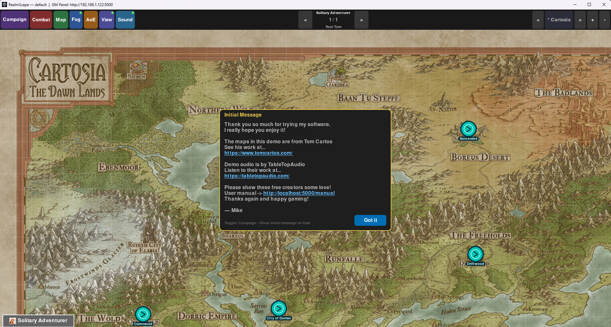

Click **Got it** to dismiss the message and begin play. The world map and all player tokens are
immediately visible on the player-facing screen.

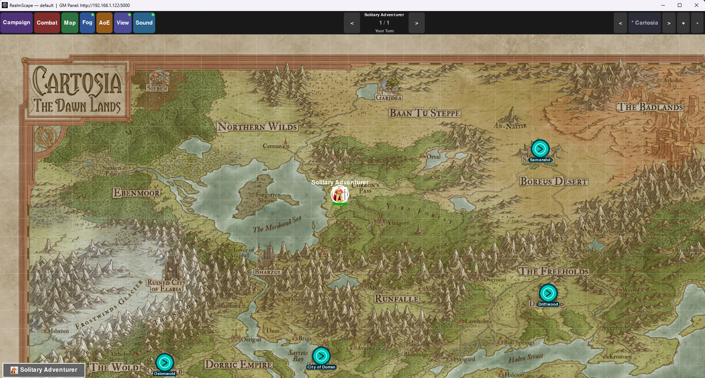

---

## The Two Screens

| Screen | Who sees it | How to access |
|--------|-------------|---------------|
| **The Map Window** | Everyone (players and GM) | The RealmScape application itself |
| **The GM Panel** | GM only | Open a web browser on **any device on the same local network** and go to `http://<RealmScape-PC-IP>:5000` |

Keep the map window on the TV or player-facing screen. Open the GM panel in a browser on your
laptop, tablet, or phone using the **local network IP address** of the PC running RealmScape. The
full URL is displayed in the RealmScape window title bar (e.g. `GM Panel: http://192.168.1.42:5000`).
All devices must be on the same Wi-Fi or wired network.

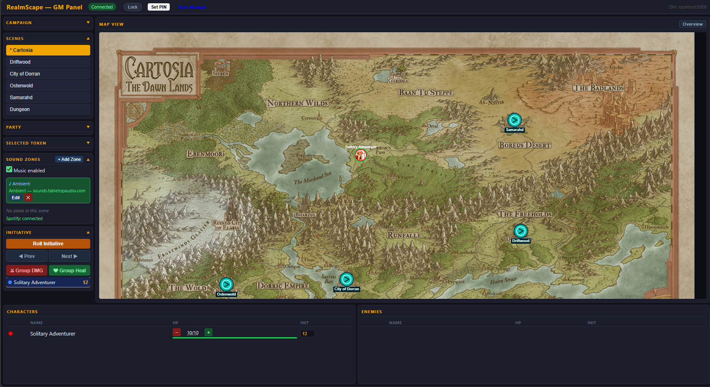

The GM Panel is divided into several sections:

- **Header bar** — shows connection status (green **Connected** badge), a **Lock** button, and the current DM URL. Lock only does something if the active campaign has a PIN (see [Campaign PINs](#campaign-pins) below).
- **Scenes** — lists every scene in the campaign. The active scene is highlighted in orange with a `*` prefix. Click any scene to switch to it.
- **Party / Selected Token** — expand to see party HP and to interact with whichever token is currently selected on the map.
- **Sound Zones** — toggle music on/off, manage zones, and set the default ambient track. Shows Spotify connection status when relevant.
- **Initiative** — **Roll Initiative**, step through turns with **Prev / Next**, apply **Group DMG** or **Group Heal**, and see each combatant's current initiative value.
- **Map View** — a live read-only thumbnail of the current scene including all tokens and scene markers.
- **Characters / Enemies** — tables at the bottom list every combatant with their HP bar and initiative value. Use the `−` / `+` buttons to adjust HP directly from the panel.

> **No network available?** See [Part 4 — Private Hotspot Mode](#part-4--private-hotspot-mode)
> to create a dedicated private Wi-Fi network just for the GM browser.

---

## Part 1 — The Toolbar at a Glance

The coloured buttons along the very top of the map window are your main controls. Click a button
to open its dropdown menu.

### Campaign

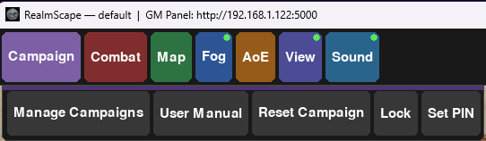

| Option | What it does |
|--------|--------------|
| **Manage Campaigns** | Create, rename, delete, and switch campaigns |
| **User Manual** | Open this manual in your browser |
| **Reset Campaign** | Reset the active campaign to its initial state |
| **Lock** | PIN-lock the map window so players cannot interact with it. Only works if the active campaign already has a PIN — see [Campaign PINs](#campaign-pins) |

---

### Combat

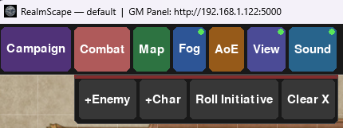

| Option | What it does |
|--------|--------------|
| **+Enemy** | Add a new enemy token to the current scene |
| **+Char** | Add a new player character token |
| **Roll Initiative** | Roll initiative for all combatants (adds each character's Initiative Bonus automatically) |
| **Clear X** | Remove all selection highlights from tokens |

---

### Map

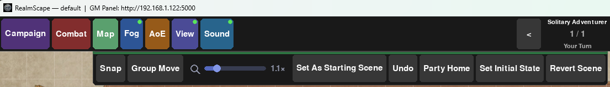

| Option | What it does |
|--------|--------------|
| **Snap** | Toggle grid snapping — tokens lock to grid squares when dragged |
| **Group Move** | Toggle group movement — all characters move together when any one is dragged |
| **Zoom slider** | Drag left to zoom out, right to zoom in. Zoom is saved per scene |
| **Set As Starting Scene** | Mark the current scene as the first scene loaded when the campaign opens |
| **Undo** | Revert the most recent token drag to its previous position. Each drag is saved to a 20-move history, so you can press Undo repeatedly to step back through multiple moves. Only token movement is undoable — HP changes, conditions, and initiative are not affected. Keyboard shortcut: **Ctrl+Z** |
| **Party Home** | Move all player tokens to the top-left corner and reset the camera |
| **Set Initial State** | Capture a complete snapshot of this scene's current state — enemy and NPC positions, HP, conditions, initiative values, hidden item locations, trap states, and scene marker positions. This snapshot is stored permanently in the campaign database. |
| **Revert Scene** | Restore this scene to the last saved snapshot: enemies and NPCs reappear at their original positions with full HP and cleared conditions, hidden items reset to undiscovered, and traps reset to untriggered. Player characters are never affected. |

---

### Replaying an Adventure with a New Group

**Set Initial State** and **Revert Scene** are designed to work together as a preparation and reset system, making it straightforward to run the same adventure multiple times — for a second play group, a convention one-shot, or a school session.

#### What gets saved

When you press **Set Initial State** on a scene, RealmScape captures a complete snapshot of everything scene-specific at that moment:

| Saved | Not saved |
|---|---|
| Enemy and NPC positions | Player characters (they are global, not scene-specific) |
| Enemy and NPC HP (current and max) | Background map image |
| Enemy and NPC conditions | Fog of war state |
| Initiative values | Camera position and zoom |
| Hidden item positions, DCs, and descriptions | Scene notes |
| Trap positions and descriptions | Music / sound zone settings |
| Scene marker (portal) positions | |

Each scene has its own independent snapshot. You can set the initial state of individual scenes at different times as you finish preparing them.

#### The replay workflow

**Step 1 — Prepare your adventure as normal**

Place enemies, NPCs, hidden items, traps, and scene markers across all your scenes. Adjust HP values, assign stat blocks, and position everything exactly as it should be at the start of the adventure.

**Step 2 — Save the initial state of each scene**

Navigate to each scene and press **Map → Set Initial State**. Do this for every scene that contains content you want to be able to restore. The **Revert Scene** button will be greyed out until at least one snapshot has been saved for the current scene.

**Step 3 — Run the session**

Play normally. Enemies are killed, items are found, traps are triggered, tokens are moved. Everything changes as it should during play.

**Step 4 — Reset for the next group**

You have two options:

- **Scene by scene** — navigate to each scene and press **Map → Revert Scene**. RealmScape will ask for confirmation, then restore that scene's content to the snapshot.
- **All at once** — press **Campaign → Reset Campaign**. This reverts every scene in the campaign that has a saved snapshot simultaneously, in a single operation. This is the fastest way to prepare for the next group.

After a revert, all enemies and NPCs reappear at their original positions with their original HP, all hidden items are unfound, and all traps are reset to untriggered. The initiative tracker is also cleared.

> **Note:** Player characters are intentionally excluded from the revert system. Their positions, HP, and conditions belong to the players and persist across sessions regardless of any scene reset.

#### Updating a snapshot mid-campaign

If you change your encounter design after the first session — repositioning enemies, adjusting HP, adding new items — simply set up the scene the way you want it and press **Set Initial State** again. The new snapshot replaces the previous one.

---

### Fog

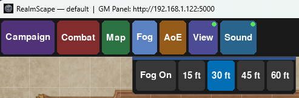

| Option | What it does |
|--------|--------------|
| **Fog On** | Toggle fog of war on/off for the current scene |
| **15 ft / 30 ft / 45 ft / 60 ft** | Set how far each player character can see through the fog (in feet) |

When fog is active, only the area within the selected radius of each player token is visible.
Enemies and items hidden in the fog cannot be seen by players until their tokens move close enough
to reveal them.

---

### AoE

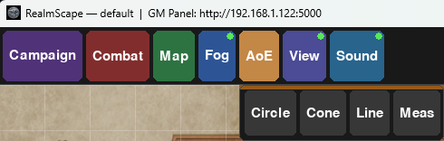

| Option | What it does |
|--------|--------------|
| **Circle** | Place a circular area-of-effect template on the map |
| **Cone** | Place a cone-shaped AoE template |
| **Line** | Place a line-shaped AoE template |
| **Meas** | Click two points on the map to measure the distance between them in feet |

After selecting a shape, click and drag on the map to place the template. Templates remain on the
map until cleared. Use **Right-click → Clear AoE templates** to remove them all at once.

---

### View

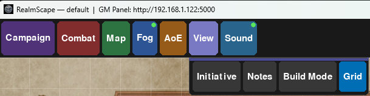

| Option | What it does |
|--------|--------------|
| **Initiative** | Show/hide the initiative tracker panel on the right side of the screen |
| **Notes** | Show/hide the GM notes panel |
| **Build Mode** | Toggle Build Mode — fog is hidden so you can see the whole map and place items invisibly |
| **Grid** | Toggle the grid overlay on/off for the current scene |

---

### Sound

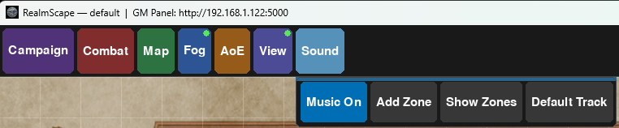

| Option | What it does |
|--------|--------------|
| **Music On** | Toggle background music playback on/off |
| **Add Zone** | Create a new sound zone — a rectangle on the map with its own track |
| **Show Zones** | Show/hide the sound zone rectangles on the map |
| **Default Track** | Set the ambient track that plays when no players are inside a named sound zone |

---

## Part 2 — Starting a New Campaign

### 2a — Creating a Campaign

A **campaign** is a self-contained folder that holds everything for one adventure: scenes, maps,
token images, audio files, character data, and your notes.

**Steps:**

1. Click the **Campaign** button in the toolbar.
2. Click **Manage Campaigns**.
3. In the Campaign Manager dialog, type a name for your campaign (e.g. "Dragon of Icespire Peak")
   in the **New campaign name…** field and click **Create**.
4. Click the new campaign name to select it (it highlights in white), then click
   **Switch to Selected**. The campaign becomes active.

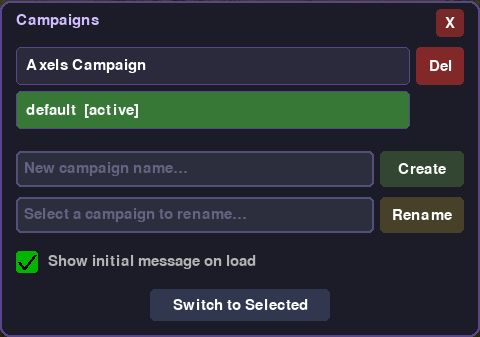

The active campaign is shown with `[active]` in green. You can have as many campaigns as you like —
only one is active at a time. Use the **Del** button (red) to permanently delete a campaign and all
its data.

> Your campaign folder is created at `campaigns/<YourCampaignName>/`. An `initial_message.txt`
> file is placed there — edit it to write a welcome note displayed to players each time the
> campaign loads. Toggle the **Show initial message on load** checkbox in the Campaign Manager to
> control whether it appears at startup.

---

### 2b — Adding Your First Map

A **scene** is one location — a tavern, a dungeon room, a wilderness area. Each scene has its own
background image (your map).

**Steps:**

1. Click the **+** button in the top-right corner of the RealmScape window to add a new scene.
   A dialog asks whether to create a **Blank Map** or **Generate Map**.
2. Choose **Blank Map** for a map you supply yourself, or see
   [Section 2c](#2c--generating-a-dungeon-map) to generate a dungeon automatically.
3. To use your own map image, **drag and drop** a JPG or PNG file directly onto the map area in
   the RealmScape window. RealmScape copies the image into your campaign folder automatically.

> **Tip:** Use high-resolution map images — RealmScape scales them to fill the window and supports
> zooming in and out with the Map toolbar slider.

---

### 2c — Generating a Dungeon Map

RealmScape can generate a fully detailed dungeon map on the fly using the built-in DungeonGen tool
— no external map image required.

**Steps:**

1. Click the **+** button (top-right corner) to add a new scene.
2. When prompted, choose **Generate Map**.

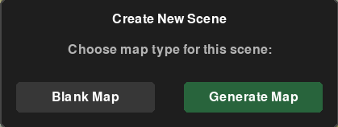

3. The **Generate Dungeon Map** dialog opens.

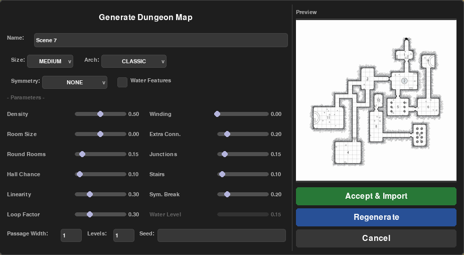

4. Configure your dungeon:
   - **Name** — the scene name (shown in the scene list).
   - **Size** — Tiny through Huge; controls the overall footprint of the dungeon.
   - **Arch** (Architecture) — Classic, Cavern, Crypt, etc.; sets the visual style.
   - **Symmetry** — None, Horizontal, Vertical, or Both; controls structural symmetry.
   - **Water Features** — tick to add rivers, pools, or moats.
   - **Sliders** — fine-tune Density, Winding, Room Size, Extra Connections, Round Rooms,
     Junctions, Hall Chance, Stairs, Linearity, Symmetry Break, Loop Factor, and Water Level.
   - **Passage Width** — width of corridors in grid squares.
   - **Levels** — number of stacked dungeon floors.
   - **Seed** — enter a specific seed to reproduce a dungeon you liked; leave blank for random.

5. A **live preview** appears on the right as you adjust settings.
6. Click **Regenerate** to generate a new dungeon with the same settings.
7. When satisfied, click **Accept & Import** — the dungeon is rendered and imported as the scene's
   background map.

**Playing the generated dungeon — Fog of War:**

With fog of war active, players only see the area immediately around their tokens. The rest of the
dungeon is hidden until they explore it.

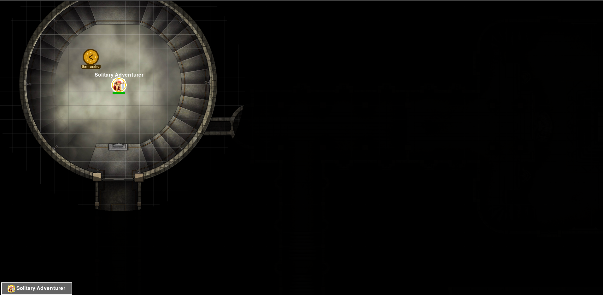

In **Build Mode** (View → Build Mode) you can see the entire dungeon layout while preparing the
session — enemies, traps, and items you place are invisible to players until fog reveals them.

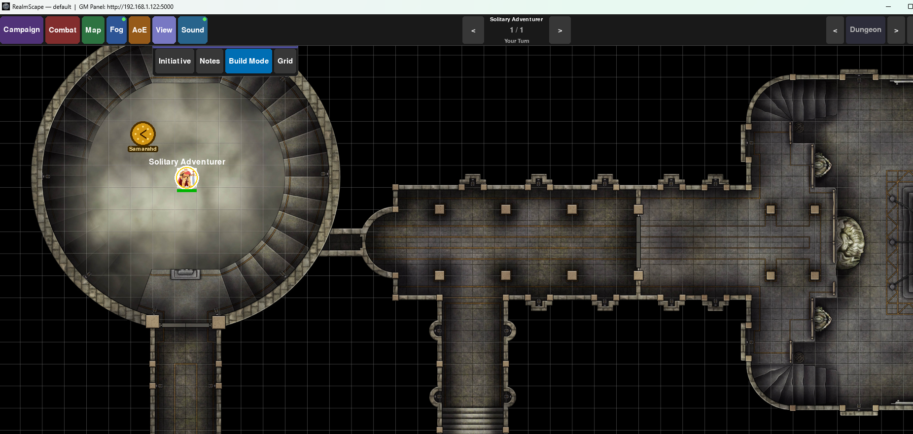

---

### 2d — Adding Player Characters

Player characters appear as tokens on the map. Each player gets their own token with a name,
colour, size, HP, and optionally a portrait image.

**Steps:**

1. Click the **Combat** button in the toolbar.
2. Click **+Char**.
3. The Character Settings dialog opens.

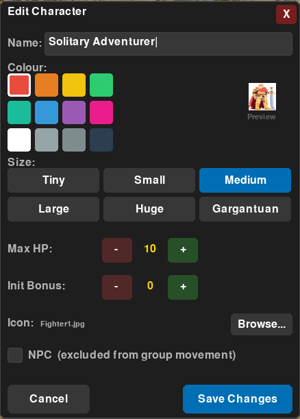

4. Fill in:
   - **Name** — the character's name.
   - **Colour** — pick a colour swatch to identify them on the map.
   - **Size** — Tiny, Small, Medium, Large, Huge, or Gargantuan (affects how large the token appears).
   - **Max HP** — the character's maximum hit points.
   - **Init Bonus** — the character's initiative modifier (DEX modifier or proficiency bonus).
     Added automatically when you roll initiative.
   - **Icon** — click **Browse…** to pick a portrait or token image. The image is copied into your
     campaign folder.
   - **NPC** — tick this if the character is a friendly NPC excluded from group movement.
5. Click **Save Changes**. The token appears on the map.
6. Drag the token to position it on the map.

**Right-clicking a token** opens the context menu:

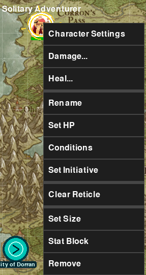

| Option | What it does |
|--------|--------------|
| Character Settings | Edit name, colour, size, HP, image |
| Damage… | Apply typed damage to this token |
| Heal… | Apply typed healing to this token |
| Rename | Quickly rename the character |
| Set HP | Adjust current or max HP with +/− buttons |
| Conditions | Apply or remove status conditions |
| Set Initiative | Set this entity's initiative value directly |
| Clear Reticle | Remove the targeting crosshair from this token |
| Set Size | Change the token's size |
| Stat Block | View or edit the creature's full stat block |
| Remove | Delete this token from the scene |

---

### 2e — Conditions and Stat Blocks

#### Conditions

Right-click a token and choose **Conditions** to open the conditions picker:

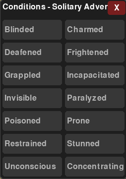

Click any condition to toggle it on or off. Active conditions are highlighted. When a token has
one or more active conditions, an **animated colour-cycling ring** orbits the token on the
player-facing screen, making affected combatants immediately obvious to everyone at the table.

Available conditions: Blinded, Charmed, Deafened, Frightened, Grappled, Incapacitated, Invisible,
Paralyzed, Poisoned, Prone, Restrained, Stunned, Unconscious, Concentrating.

#### Stat Block

Right-click a token and choose **Stat Block** to view or edit the creature's statistics:

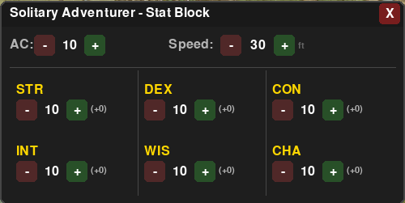

Set **AC**, **Speed** (in feet), and all six ability scores. The modifier in parentheses updates
automatically. Stat blocks are saved per-entity and visible in the GM panel.

---

### 2f — Setting Up Sound Zones and Music

RealmScape plays background music natively — **no external media player is required**.

#### Supported Audio Sources

| Source | How to use |
|--------|------------|
| **Local files** | Type the full path to an MP3, OGG, or WAV file |
| **Tabletop Audio** | Paste any `tabletopaudio.com` page URL — RealmScape downloads and caches the track automatically |
| **Spotify** | Paste an `open.spotify.com` link — requires the Spotify desktop app installed and signed in on the same machine |

#### Setting the Default Ambient Track

The **default zone** plays whenever players are not inside any named sound zone.

1. Click the **Sound** button in the toolbar.
2. Click **Default Track**.
3. Enter a track (file path, Tabletop Audio URL, or Spotify link) and click **Save**.

#### Adding a Named Sound Zone

A sound zone is a coloured rectangle on the map. When any player token enters it, the music
crossfades to that zone's track.

1. Click the **Sound** button in the toolbar.
2. Click **Add Zone**.
3. The Sound Zone dialog opens:

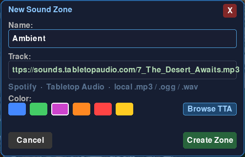

4. Give the zone a **Name**, enter or paste a **Track**, and pick a highlight **Color**.
5. Click **Browse TTA** to search and preview the full Tabletop Audio catalogue without leaving
   the application:

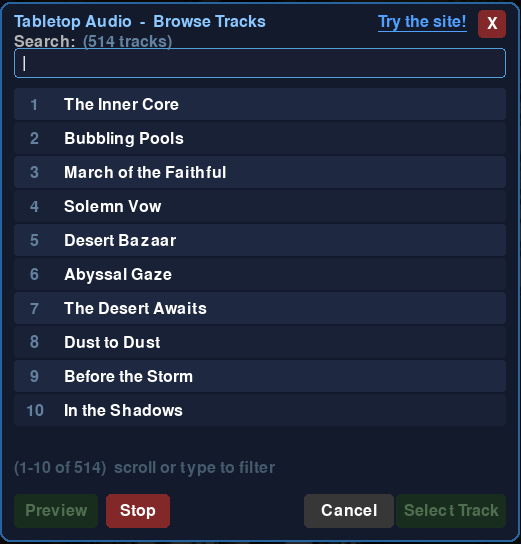

   Type to filter by name, click **Preview** to listen, **Stop** to stop playback, then
   **Select Track** to copy the URL back to the zone dialog.
6. Click **Create Zone** to save. Then **click and drag** on the map to draw the zone's rectangle.

#### Audio Cache

Downloaded Tabletop Audio tracks are stored in the `cache/audio/` folder inside the RealmScape
application directory. The cache is **shared across all campaigns** — each track is downloaded
only once. Subsequent plays start instantly from the cache.

---

### 2g — Adding New Scenes

Most campaigns have many locations. Each is its own scene.

Click the **+** button (top-right corner of the window) to add a scene, or the **−** button to
delete the current scene (requires confirmation). The current scene name is shown in the
top-right area of the toolbar.

Each scene independently remembers:
- Background map image (or generated dungeon)
- Camera position and zoom level
- Fog of war settings and revealed area
- Grid on/off
- Sound zones
- Enemy tokens
- Scene notes (visible only in the GM panel)

---

### 2h — Linking Scenes with Scene Markers

Scene markers are portals on the map. When a player token moves near one, RealmScape offers to
transition the whole party to a linked scene — useful for doors, staircases, and cave entrances.

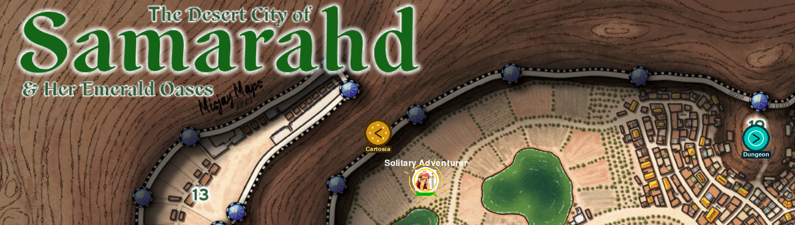

- **Teal markers** (with a `>` arrow) link forward to a destination scene.
- **Gold/amber markers** (with a `<` arrow) are return portals back to where the party came from.

**Placing a marker:**

1. Right-click on an empty area of the map.
2. Choose **Drop Scene Marker**.
3. A dialog asks which scene to link to. Choose the destination.
4. A teal portal icon appears. Drag it to fine-tune its placement (e.g. next to a doorway).

**How it works in play:**

When a player token is dragged near a scene marker, a confirmation prompt appears. Confirming
moves the camera and all player tokens to the new scene automatically. A **return portal** (gold)
is placed on the destination scene pointing back to where the party came from. Multiple levels of
transitions are supported — Scene A → Scene B → Scene C each maintains its own return path.

---

### 2i — Build Mode

Build Mode is the GM's private workspace. While active:

- **Fog of war is temporarily hidden** so you can see the whole map clearly.
- **Items and traps you place are invisible to players** until the scene exits Build Mode.
- **Player tokens remain visible** so you can position things relative to where the party is.

**To enter Build Mode:** Click **View** → **Build Mode** (the button highlights blue).

**To exit Build Mode:** Click **Build Mode** again. Fog of war returns to its previous setting.

---

### 2j — Stocking Your Scene with Enemies, Traps, and Secret Items

Right-clicking on empty map space opens the map context menu:

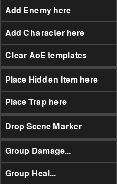

#### Adding Enemies

1. Right-click on an empty area and choose **Add Enemy here**, or use **Combat → +Enemy**.
2. A new enemy token appears at that location.
3. **Right-click the enemy token** and choose **Character Settings** (shown as "Enemy Settings"
   for enemies) to set its name, colour, size, HP, and portrait.
4. Drag the enemy to its starting position.
5. Enemies under fog of war are invisible to players until revealed by proximity.

> **Tip:** Drag an image file directly onto an enemy token to quickly assign a portrait without
> opening the settings dialog.

#### Adding Traps

1. Make sure **Build Mode** is on.
2. Right-click an empty area and choose **Place Trap here**.
3. Fill in the trap description and trigger radius.
4. Click **Save**. The trap marker is invisible to players.

When a player token moves within the trigger radius the trap fires automatically — a red flash
appears on the screen. To re-arm a triggered trap, right-click it and choose **Reset Trap**.

#### Adding Secret / Hidden Items

1. Make sure **Build Mode** is on.
2. Right-click an empty area and choose **Place Hidden Item here**.
3. Give the item a description and a DC (the skill check difficulty required to find it).
4. Click **Save**. A small red dot marks the item — invisible to players until they succeed on
   the relevant check.

---

### 2k — Bringing It All Together

A quick checklist before your first session:

**Before the session:**

- [ ] Campaign created and named.
- [ ] At least one scene added with a map image or generated dungeon.
- [ ] Player characters created (one per player at the table).
- [ ] Enemies placed in Build Mode and their settings configured.
- [ ] Traps and hidden items placed in Build Mode.
- [ ] Sound zones set up with tracks.
- [ ] Fog of war turned **on** (Fog → Fog On).
- [ ] Build Mode turned **off**.
- [ ] Starting scene set (Map → **Set As Starting Scene**).
- [ ] GM panel open in your browser at the URL shown in the window title bar.

**During the session:**

1. Players sit around the player-facing screen showing the RealmScape map window.
2. You control everything from the GM panel in your browser.
3. **Roll Initiative** — click **Combat → Roll Initiative** or use the GM panel button. Initiative
   order appears and is tracked automatically.
4. **Move tokens** — drag tokens on the map to move players and enemies.
5. **Manage HP** — right-click any token and choose **Damage…** or **Heal…** for a single target,
   or use **Group Damage / Group Heal** (see Part 3) for multiple targets.
6. **Apply conditions** — right-click and choose **Conditions**. An animated colour-cycling ring
   orbits tokens that have active conditions.
7. **Traps fire automatically** — when a player token enters a trap's radius, a red flash triggers.
   Right-click the trap and choose **Reset Trap** to re-arm it.
8. **Transition scenes** — when players reach a scene marker, confirm the transition. All tokens
   move to the new scene.
9. **AoE spells** — click **AoE**, pick a shape, and drag on the map to place the template.
10. **Measure distance** — click **AoE → Meas**, then click two points. Distance in feet appears.

---

## Part 3 — Group Damage and Group Healing

When an area-of-effect spell or ability affects multiple targets, use the Group Damage / Heal
feature to apply a flat amount to several tokens at once.

### From the Map Window

Right-click on an empty area of the map and choose **Group Damage…** or **Group Heal…**. The
dialog lists all visible combatants.

### From the GM Panel

In the **Initiative** section of the GM panel, use the **⚔ Group DMG** or **♥ Group Heal**
buttons below the Prev / Next turn controls.

### Using the Dialog

1. **Select targets** — all visible combatants are pre-selected. Click a row to toggle a target
   on or off. Use **All** or **None** to quickly select or deselect everyone.
2. **Enter an amount** — type the number of hit points to apply.
3. Click **Damage** (subtracts, floored at 0) or **Heal** (adds, capped at max HP).
4. Click **Cancel** or press **Escape** to close without applying anything.

> **Fog of War:** Only entities currently visible within the fog of war area appear in the list.
> Hidden enemies are excluded. When fog is off, all combatants in the initiative order are shown.

---

## Part 4 — Private Hotspot Mode

If you are running a session somewhere without a Wi-Fi network (a library, a friend's house, a
convention), RealmScape can create its own **private Wi-Fi hotspot** so your GM browser can
connect directly — no router required.

### How It Works

The **Hotspot Daemon** is a separate application (`hotspot_daemon.py`) that creates a password-
protected Wi-Fi access point your GM device connects to. It enforces **single-client mode** —
only one device (your GM browser) is allowed to join the network; any other connection attempt is
rejected at the hardware level.

- A **new random password** is generated every time the daemon starts.
- The daemon writes the network name (SSID), password, GM URL, and a periodic heartbeat to a
  status file that RealmScape reads.
- When the daemon is active and the GM has not yet connected, a **black information box** appears
  in the top-right corner of the map window showing the SSID, password, and URL to type into
  the GM browser.
- Once the GM browser connects via SocketIO, the black box disappears automatically.
- If the GM browser disconnects, the box reappears so the GM can reconnect.
- The window title bar also updates to show the hotspot URL instead of the regular LAN IP.

### Setup — Windows

1. Run `install_hotspot.bat` once to verify your system is capable.
2. Each session: run `run_hotspot.bat` — it self-elevates (you will see a UAC prompt), then
   starts the hotspot. The terminal shows the SSID and password.
3. Connect your GM browser device to the `RealmScape-DM` Wi-Fi network using the displayed
   password.
4. Open a browser and navigate to the URL shown in the overlay box on the RealmScape window.

### Setup — Linux

1. Run `./install_hotspot.sh` once to install `hostapd`, `dnsmasq`, and `iw`.
2. Each session: run `./run_hotspot.sh` — it self-elevates via `sudo` and starts the hotspot.
3. Connect your GM device to the `RealmScape-DM` network.

### Notes

- The hotspot daemon detects if the machine is **already connected to a network**. If it is, the
  daemon exits immediately — no hotspot is created, and the overlay box is not shown.
- On Windows the hotspot shares the machine's ethernet connection. On Linux, `hostapd` creates a
  standalone access point.
- The hotspot SSID defaults to `RealmScape-DM`. You can override it:
  `run_hotspot.bat --ssid MyGame`

---

## Part 5 — Quick Reference

### Right-Click Token Menu

| Option | What it does |
|--------|--------------|
| Character Settings / Enemy Settings | Edit name, colour, size, HP, image |
| Damage… | Apply typed damage amount to this token |
| Heal… | Apply typed healing amount to this token |
| Rename | Quickly rename without opening the full settings dialog |
| Set HP | Adjust current or max HP with +/− buttons |
| Conditions | Apply/remove status conditions |
| Set Initiative | Set this entity's initiative value directly |
| Clear Reticle | Remove the targeting crosshair from this token |
| Set Size | Change the token's size |
| Stat Block | View or edit the creature's full stat block |
| Remove | Delete the token from the scene |

### Right-Click Empty Map Menu

| Option | What it does |
|--------|--------------|
| Add Enemy here | Place a new enemy token at this location |
| Add Character here | Place a new player character at this location |
| Clear AoE templates | Remove all AoE overlays from the map |
| Place Hidden Item here | Drop a hidden discoverable item at this location |
| Place Trap here | Drop a hidden trap at this location |
| Drop Scene Marker | Link this location to another scene |
| Group Damage… | Open the group damage/heal dialog |
| Group Heal… | Open the group damage/heal dialog |

### Keyboard Shortcuts (Map Window)

| Key | Action |
|-----|--------|
| Arrow keys | Pan the camera |
| Shift + Arrow keys | Move all player characters |
| Escape | Close any open dialog or popup |
| Enter / Space | Confirm a dialog |
| Ctrl+Z | Undo the last token move |
| Digits + Backspace | Type an amount in number-input dialogs |

### Mouse Controls (Map Window)

| Action | Result |
|--------|--------|
| Left-click + drag on token | Move the token |
| Left-click + drag on empty map | Pan the camera |
| Right-click | Open context menu |
| Drag image file onto token | Assign a portrait image to that token |
| Drag image file onto map | Set the scene's background map image |
| Scroll wheel | Scroll entity list in Group Damage/Heal dialog (when open) |

### Touch Controls (Map Window)

| Action | Result |
|--------|--------|
| Tap | Select a token, or press a button/dialog control |
| Drag on token or scene marker | Move it |
| Two-finger drag | Pan the camera |
| Long-press | Open the context menu (same as right-click) |

---

## Part 6 — Tips and Tricks

- **Grid toggle** — turn the grid on or off per scene (View → Grid). Useful when your map already
  has a printed grid.
- **Party Home** — Map → Party Home instantly moves all player tokens to the top-left corner and
  resets the camera. Handy after a scene reset.
- **Revert Scene / Set Initial State** — use these together to replay the same adventure with a new group. See [Replaying an Adventure with a New Group](#replaying-an-adventure-with-a-new-group) for the full workflow, including the one-click **Campaign → Reset Campaign** option that reverts all scenes at once.
- **Initiative Bonus** — set each character's DEX modifier under Character Settings. It is added
  automatically every time you roll initiative.
- **Lock Screen** — Campaign → Lock PIN-protects the RealmScape window so players cannot tap
  buttons on the TV. Unlock from the GM panel or by entering the PIN. Only available once the
  active campaign has a PIN — see [Campaign PINs](#campaign-pins) below.
- **Scene Notes** — in the GM panel expand **Scene Notes** to write private reminders (monster
  stats, read-aloud text, treasure lists). Notes are never shown on the player-facing screen.
- **Initial Message** — edit `campaigns/<YourCampaign>/initial_message.txt` to write a welcome
  message displayed at campaign load. Toggle it via Campaign → Manage Campaigns →
  **Show initial message on load**.
- **Multiple monitors** — run the RealmScape window on your TV (set it as a second display in
  Windows Settings) and keep the GM panel on your laptop.
- **Condition swirl** — any token with one or more active conditions shows an animated
  colour-cycling ring orbiting it. This makes affected tokens obvious at a glance on the
  player-facing screen. The ring disappears when all conditions are cleared.
- **TTA Browse** — use **Browse TTA** in the Sound Zone dialog to search and preview the entire
  Tabletop Audio catalogue (500+ tracks) from within the application. The first play downloads
  the track to the local cache; future plays are instant.
- **Set As Starting Scene** — Map → Set As Starting Scene marks which scene loads first when the
  campaign opens. The starting scene is indicated with a `*` prefix in the scene list.
- **Multiple campaigns** — RealmScape loads whichever campaign was active when it last closed.
  Switch campaigns at any time via Campaign → Manage Campaigns.
- **Duplicate seed dungeon** — in the DungeonGen dialog, note the **Seed** value shown after
  generating. Enter it again later to reproduce the exact same dungeon layout.
- **NPC characters** — tick **NPC** in Character Settings to exclude a friendly NPC from group
  movement so they don't get dragged around when you move the whole party.
- **Startup cleanup** — RealmScape automatically removes orphaned database records on startup
  (scene data for deleted scenes, positions for deleted characters, etc.). No maintenance required.

### Campaign PINs

PINs are per-campaign, not system-wide. A campaign only gets a PIN when you **Save** (export) it
from the GM panel's Campaign Manager — the first time you save a campaign, you're required to set
a PIN for it before the download proceeds. The **default** campaign can never have a PIN.

Once a campaign has a PIN:

- Loading or switching into it — on the map window, from the GM panel, or on RealmScape startup —
  immediately locks both screens. Nothing can be viewed or touched on the map window, and the GM
  panel is locked out too, until that campaign's PIN is entered on either one.
- The **Lock** button (map window toolbar and GM panel header) re-locks it on demand.
- Campaigns without a PIN (including every campaign that existed before this feature, and any new
  campaign you haven't saved yet) are never locked and need no PIN at all.

**There is no way to recover a lost PIN.** Write it down somewhere safe when you set it — if it's
forgotten, that campaign can never be loaded or played again.

### Demo Mode

Intended for a public/kiosk install (a convention booth, a shared machine) rather than normal
personal use. To turn it on, create an empty file named `DEMO_MODE` in the RealmScape folder
(next to `VERSION`) and restart. While it's present:

- RealmScape always boots into the **default** campaign, regardless of whatever campaign was
  active when it last closed.
- Any other campaign with **no PIN** that hasn't been loaded in 30 days is automatically deleted
  on startup, to keep leftover campaigns from previous visitors from piling up. This check runs
  silently (no popup) and just prints what it removed to the console. Campaigns with a PIN are
  never purged, however old.

Delete the `DEMO_MODE` file (and restart) to return to normal behavior.

---

## Part 7 — Troubleshooting

| Problem | Solution |
|---------|----------|
| No sound / music silent | Check that **Music On** is enabled (Sound toolbar). For Tabletop Audio tracks, an internet connection is required the first time; subsequent plays use the local cache. |
| Audio track won't play | Ensure the path or URL is correct. Supported formats: local MP3/OGG/WAV, Tabletop Audio URLs, Spotify links (Spotify desktop app must be open and signed in). |
| Map won't load | Drag a JPG or PNG image file directly onto the map area in the RealmScape window. |
| Tokens invisible | Fog of war may be hiding them. Check Fog → Fog On. In Build Mode you can see everything. |
| GM panel not loading | Make sure RealmScape is running. Use the URL shown in the RealmScape window title bar. Ensure your GM device is on the same Wi-Fi or wired network. Try a different browser if the page shows an error. |
| GM panel shows "Connecting" forever | The browser cannot reach the RealmScape server. If you are on the hotspot, verify you are connected to the `RealmScape-DM` Wi-Fi network and are using the IP shown in the black overlay box, not the URL from the title bar of a previous session. |
| Initiative not updating | Click **Roll Initiative** in the GM panel or via Combat → Roll Initiative. Clicking it again re-rolls everyone with their current bonuses. |
| Campaign won't switch | Make sure all dialogs are closed before switching campaigns. |
| Group Damage/Heal list is empty | No combatants are visible. If fog of war is active, only entities within the party's vision are shown. Turn fog off or move player tokens closer to reveal enemies first. |
| Scene marker disappeared | Return markers (gold/amber) are automatically placed when transitioning and may be cleared on campaign reload. Permanent markers (teal) are saved to the database and persist across restarts. |
| Condition swirl not showing | The swirl only appears when at least one condition is active. Right-click the token and open **Conditions** to verify. |
| DungeonGen not available | The dungeon generator requires the `skia-python` library which supports Python 3.10–3.12 only. If you see an error, ensure you installed using a compatible Python version (see `install.bat` or `install.sh`). |
| Hotspot daemon not detected | Verify `hotspot_daemon.py` is running (check its terminal window). The daemon writes a heartbeat every 5 seconds — if it crashes or is closed, RealmScape considers it inactive after 15 seconds and hides the overlay. |
| Hotspot: second device connected | The hotspot enforces single-client mode at the network level. Additional devices attempting to join are refused. If a device is connected but no GM browser is open, disconnect that device and reconnect with the GM device. |

---

*Manual version: June 2026*
*RealmScape is an independent project by Mike.*
